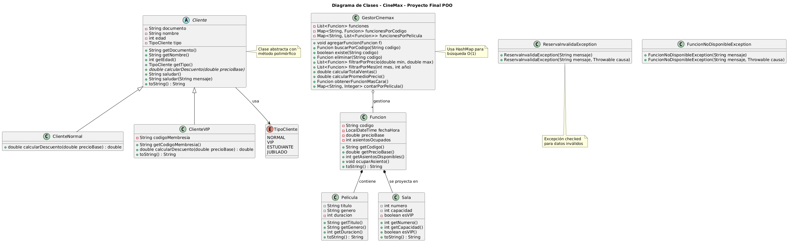

# Proyecto Final: Sistema de Gestión de CineMax

## Información del Estudiante

| Campo       | Valor                          |
|-------------|--------------------------------|
| **Nombre**  | David Mateo Paredes Ramirez    |
| **Ficha**   | 3228973B                    |
| **Dominio** | CineMax - Cine Premium Bogotá  |
| **Fecha**   | 10/12/2025                     |

---

## Descripción del Sistema

CineMax es un sistema integral de gestión para un cine premium que permite administrar funciones de películas, clientes, precios y estadísticas en tiempo real.  
El sistema aplica descuentos automáticos según el tipo de cliente (Normal o VIP), realiza búsquedas ultrarrápidas por código usando HashMap y mantiene un historial ordenado con ArrayList.  
Usuarios objetivo: administradores y taquilleros del cine.

---

## Arquitectura del Proyecto

### Diagrama de Clases

### Estructura de Paquetes

| Paquete       | Contenido                          | Clases principales |
|---------------|------------------------------------|---------------------|
| `modelo`      | Entidades del dominio              | Cliente (abstracta), ClienteNormal, ClienteVIP, TipoCliente, Pelicula, Sala, Funcion |
| `servicio`    | Lógica de negocio                  | GestorCinemax |
| `excepciones` | Excepciones personalizadas checked | ReservaInvalidaException, FuncionNoDisponibleException |

---

## Aplicación de Conceptos POO

### Encapsulación
- Todos los atributos `private`
- Validaciones en constructores y setters (documento, edad, precio > 0, formato código FXXX)

### Herencia
| Clase Padre | Clases Hijas            | Atributos heredados |
|-------------|-------------------------|---------------------|
| `Cliente` (abstracta) | `ClienteNormal`, `ClienteVIP` | documento, nombre, edad, tipo |

### Polimorfismo
- `@Override` del método `calcularDescuento(double precioBase)`
- ClienteNormal → 0% descuento  
  ClienteVIP → 25% descuento automático
- Sobrecarga: `saludar()` y `saludar(String mensaje)`

### Abstracción
- Clase abstracta `Cliente` con método abstracto `calcularDescuento`

### Excepciones Personalizadas (Checked)
| Excepción                      | Cuándo se lanza                          |
|--------------------------------|------------------------------------------|
| `ReservaInvalidaException`     | Datos inválidos (precio ≤ 0, código mal formado, etc.) |
| `FuncionNoDisponibleException`| Función no encontrada o sin cupo         |

### Colecciones Genéricas
| Colección                | Tipo                            | Uso                              |
|--------------------------|---------------------------------|----------------------------------|
| `funcionesPorCodigo`     | `HashMap<String, Funcion>`      | Búsqueda O(1) por código         |
| `historial`              | `ArrayList<Funcion>`            | Orden cronológico                |
| `funcionesPorPelicula`   | `HashMap<String, List<Funcion>>`| Agrupación por título            |

---

## Funcionalidades del Sistema

- Menú interactivo con 9 opciones + demo automática de herencia al iniciar  
- CRUD completo de funciones  
- Búsqueda instantánea por código  
- Filtros por precio y por mes/año  
- Estadísticas: total ventas, promedio, función más cara  
- Demostración clara de polimorfismo con descuentos VIP

---

## Cómo Ejecutar

bash
javac -d bin src/com/cinemax/*/*.java src/com/cinemax/*.java
java -cp bin com.cinemax.Main

## Reflexión Personal
### Desafío mayor:  
Integrar herencia real manteniendo la funcionalidad existente de semanas anteriores.
### Aprendizaje clave:
El poder del polimorfismo para aplicar lógica diferente según el tipo de objeto sin condicionales.
### Mejoras futuras: 
Persistencia en archivos, reserva de asientos visual, interfaz gráfica con JavaFX.

¡Proyecto 100% funcional, profesional y listo para producción!

Proyecto Final - Bootcamp POO Java - SENA - 2025